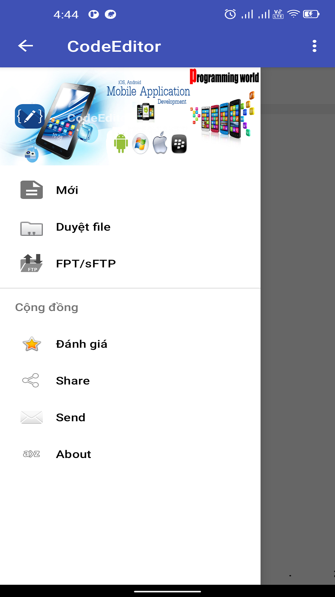

# CodeEditor


**Available on [Galaxy Store](http://galaxystore.samsung.com/detail/com.tglt.code.editor) and [Google Play](https://play.google.com/store/apps/details?id=com.tglt.code.editor)**
*(disponible sur [Galaxy Store](http://galaxystore.samsung.com/detail/com.tglt.code.editor) et [Google Play](https://play.google.com/store/apps/details?id=com.tglt.code.editor))*

[](https://github.com/vietnux/CodeEditorMobile/releases)
[](http://galaxystore.samsung.com/detail/com.tglt.code.editor)
[](https://play.google.com/store/apps/details?id=com.tglt.code.editor)  
A cool and optimized code editor on Android platform with good performance and nice features.

***Work In Progress*** This project is still developing slowly. Bugs may be inside.
It is **not** recommended to use this project for production use.   
***Note:***
Any method or field can be changed, moved or even deleted at current period.     
If you find any bug or require any enhancement, please send it to me by issues or other ways.
Download newest sources from [Releases](https://github.com/vietnux/CodeEditorMobile/releases) instead of cloning this repository directly.

**Issues and pull requests are welcome.**   
Note: Language issues may not be handled.   
## Features
  ⭐ Smooth syntax highlighting for multiple languages (C++, Java, JavaScript, HTML, Markdown, PHP, Perl, Python, Lua, Dart, etc)  
  ⭐ Preview HTML and Markdown files.  
  ⭐ Code Editor is an engine that can compile and run Java code  
  ⭐ Auto completion  
  ⭐ Auto indent  
  ⭐ Code block lines  
  ⭐ Scale text  
  ⭐ Select text  
  ⭐ Scroll, Scrollbars, EdgeEffect, OverScroll  
  ⭐ Undo/redo changes without limit  
  ⭐ Search and replace  
  ⭐ Shortcuts  
  ⭐ Auto wordwrap  
  ⭐ Show non-printable characters  
  ⭐ Incremental highlight Analysis  
  ⭐ Plugin System  
  ⭐ Access files from FTP, FTPS, SFTP and WebDAV.  
## Language Supported  
* PHP, Java, JavaScript, CSS, Dart, C, C++, HTML, Python (Basic Support:highlight, code block line, identifier and keyword auto-completion). Code block line isn't available for HTML Language.
## Screenshots





## How to use this editor  
* Step 1.Add the JitPack repository to your build file   
Add it in your root build.gradle at the end of repositories:
```Gradle
allprojects {
  repositories {
    ...
    maven { url 'https://jitpack.io' }
  }
}
 ```
* Step 2. Add the dependency to your app
```Gradle
dependencies {
  implementation 'com.github.Rosemoe.CodeEditor:<moduleName>:<versionName>'
}
```
Available modules:     
* editor 
* language-base
* language-java
* language-html
* language-python
* language-universal   
### Some more information
Go to [Wiki](https://github.com/vietnux/CodeEditorMobile/wiki)

## Donate
If you like DreamsTube we'd be happy about a donation. You can either send bitcoin or donate via Bountysource or Liberapay. For further info on donating to DreamsTube, please visit our [website](http://thegioilaptrinh.net/app/appru/DreamsTube.htmldonate).

<table>
  <tr>
    <td></td>
    <td></td>
    <td><samp>16A9J59ahMRqkLSZjhYj33n9j3fMztFxnh</samp></td>
  </tr>
  <tr>
    <td><a href="https://liberapay.com/TeamDreamsTube/"></a></td>
    <td><a href="https://liberapay.com/TeamDreamsTube/"></a></td>
    <td><a href="https://liberapay.com/TeamDreamsTube/donate"></a></td>
  </tr>
  <tr>
    <td><a href="https://www.bountysource.com/teams/dreamstube"></a></td>
    <td><a href="https://www.bountysource.com/teams/dreamstube"></a></td>
    <td><a href="https://www.bountysource.com/teams/dreamstube/issues"></a></td>
  </tr>
</table>

